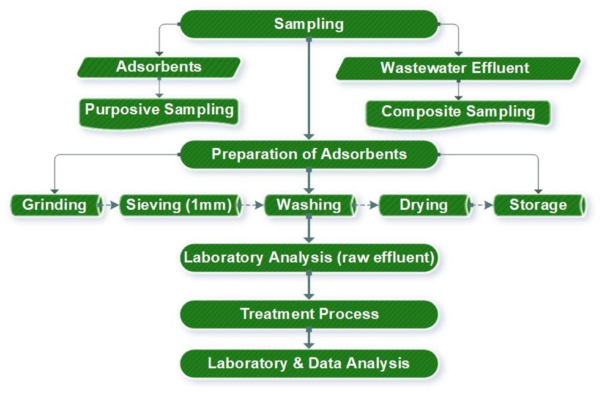
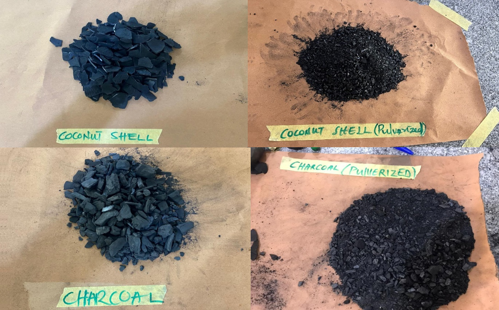
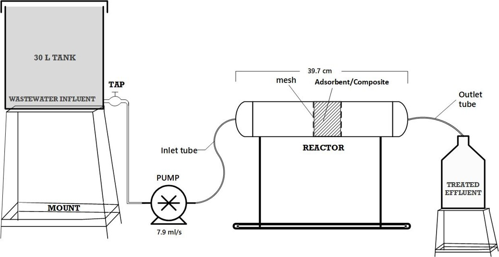
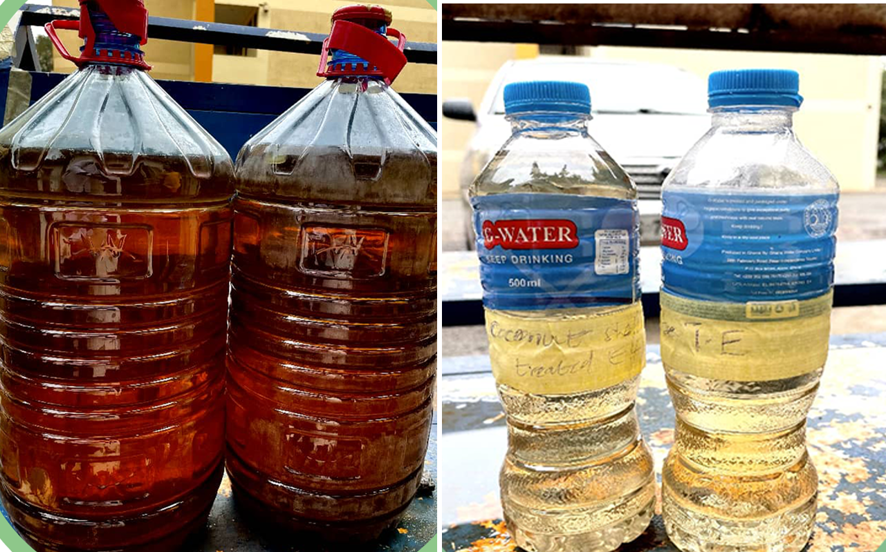
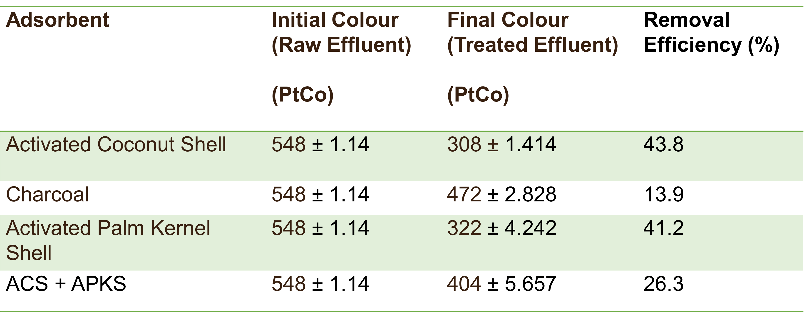

# CASE STUDY: BIOCHAR-BASED TECHNOLOGY FOR WASTEWATER TREATMENT
  
### Title: *Low-Cost Adsorbents for Wastewater Colour Removal Using Agricultural Waste*

### Duration: *Jan - Aug 2024*

### Role: *Undergraduate Researcher (Project Lead), Department of Environmental Science, KNUST*

### Objective: *Investigate the use of biochar-based adsorbents (coconut shells, palm kernel shells, and charcoal) for removing colour pollutants from wastewater in a cost-effective and sustainable way.*

## Problem Statement
Wastewater from textile and dye industries often contains persistent colour pollutants that are difficult to remove. The **Kumasi Wastewater Treatment Plant (KWWTP)** currently struggles to meet Environmental Protection Agency (EPA) standards due to the high levels of colour present in its effluent. The treatment method in use **(Activated Sludge)** has proven inadequate in significantly reducing wastewater colour, leaving compliance and environmental safety concerns unresolved. This challenge highlights the urgent need for low-cost, eco-friendly adsorbents that can be produced locally to provide a sustainable and effective solution for wastewater colour removal.

## Methodology
  * Study Location: *Kumasi Wastewater Treatment Plant (KWWTP).*
  * Adsorbent Sampling: *Coconut shells, palm kernel shells, and charcoal collected locally.*
  * Pretreatment: *Grinding, sieving, washing, and drying.*
  * Experimental Setup: *Batch adsorption tests on wastewater effluent.*
  * Analysis Tools: *UV-Vis spectrophotometry, adsorption isotherm modeling (Langmuir, Freundlich).*
  * Parameters Measured: *Colour, turbidity, pH, temperature, TDS, and EC before and after treatment.*

## Key Results
  * Coconut shell biochar showed the highest colour removal efficiency.
  * Composite adsorbents (mixtures of best-performing materials) improved removal rates compared to individual adsorbents.
  * Demonstrated cost savings compared to conventional activated carbon.
  * Identified optimal operating conditions (pH, dosage, contact time) for maximum adsorption.

## Visuals & Deliverables

*methodology*

*biochars*

*setup*

*raw (right) and treated (left) effluent*

*lab setup for analysis*

.
*results table*

## Impact & Applications
  * Provides a sustainable solution for wastewater treatment in Ghana.
  * Directly addresses challenges faced by KWWTP, offering a pathway to meet EPA standards.
  * Encourages circular economy by reusing agricultural waste.
  * Potential for adoption by local textile industries and municipal treatment facilities.

## Research Contribution
This research contributes to the growing body of work exploring waste-to-resource technologies for environmental remediation. The study demonstrates that agricultural residues commonly regarded as waste can be transformed into functional adsorbent materials capable of improving water quality. By utilizing locally available biomass resources, the proposed approach provides an accessible pathway for developing cost-efficient wastewater treatment strategies.

The project also highlights the importance of integrating materials science, environmental engineering, and resource recovery in addressing water pollution challenges.

## Environmental and Societal Relevance
Water pollution from industrial effluents remains a major environmental concern in many developing regions. Technologies that rely on imported materials or advanced infrastructure are often economically impractical.

**Biochar-based adsorption offers several advantages:**
  * Utilizes locally available agricultural waste
  * Reduces environmental pollution from dye effluents
  * Supports sustainable waste management practices
  * Provides an affordable option for decentralized wastewater treatment systems

By linking waste valorization with water treatment, the approach contributes to circular resource use and sustainable environmental management.

